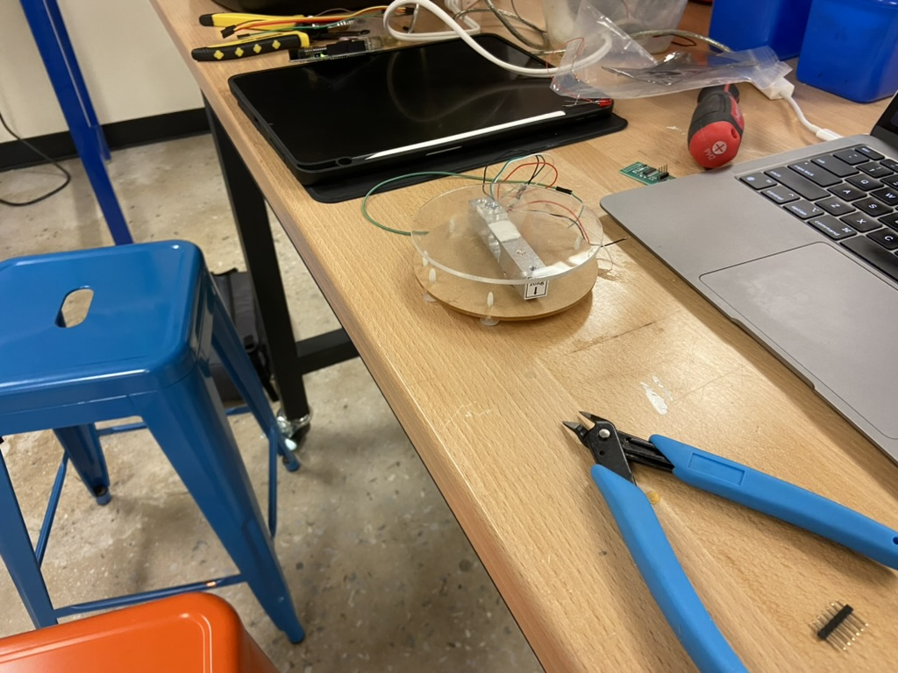
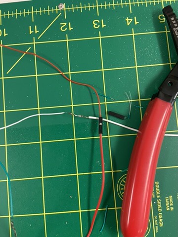
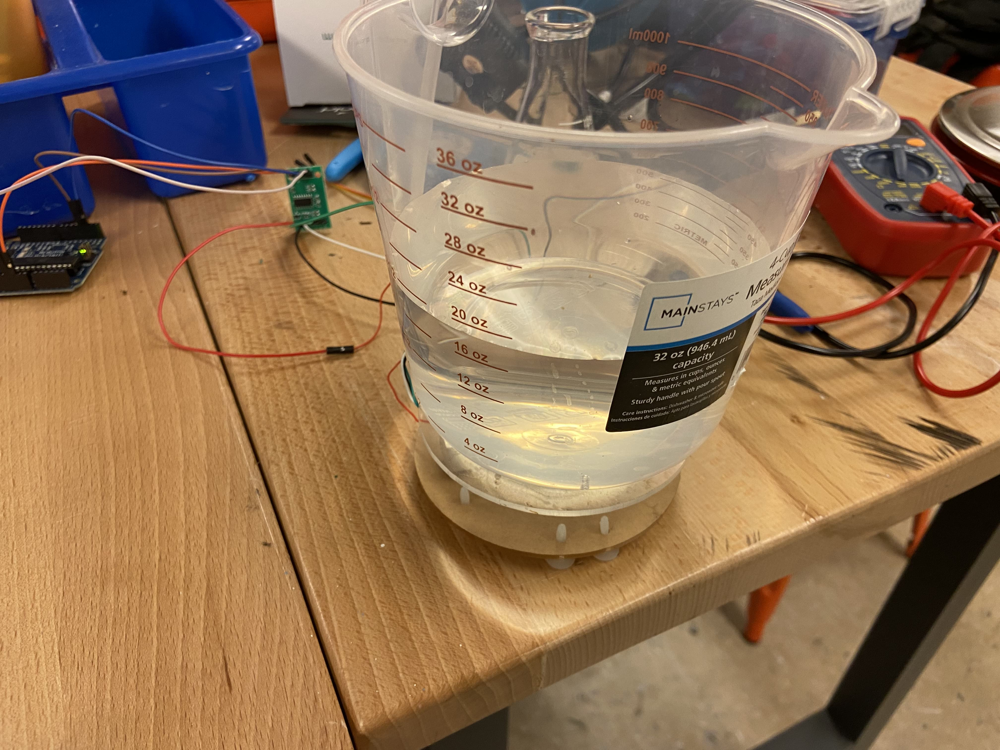
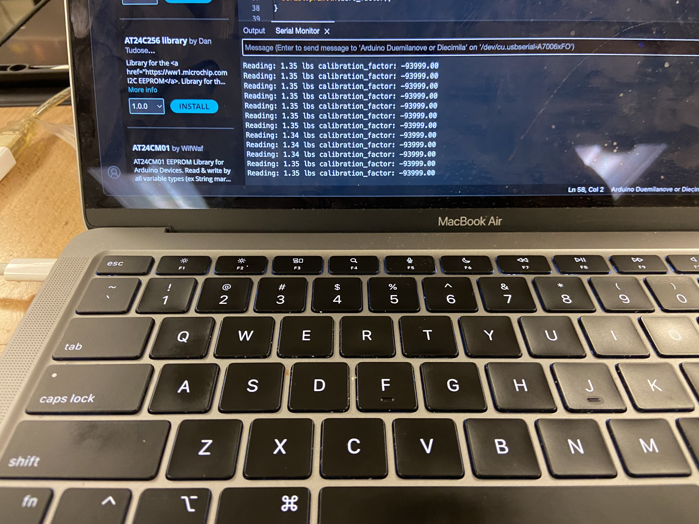
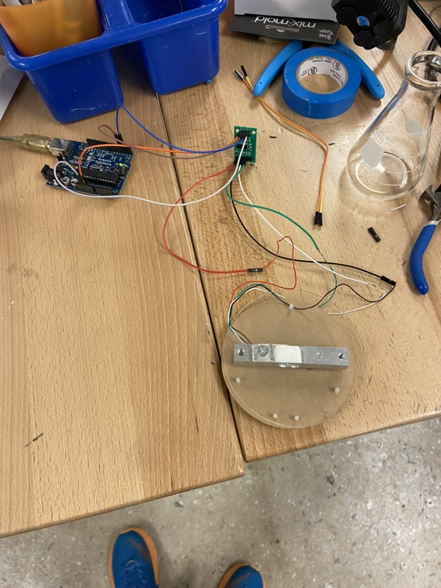

# Work Log: Setting Up 10kg Load Cell for Plant Watering System

## Date: August 8, 2024

## Equipment Used:

- **10kg Load Cell** (Bought from [Amazon](https://www.amazon.com/Geekstory-Converter-Breakout-Electronic-Raspberry/dp/B0D293F1CW/ref=sr_1_7?dib=eyJ2IjoiMSJ9.xMiUE1Rd8vlV0k9aypBFjV0GjQhqL6JNI2v42oVwuet-1SapgyaG0Ef3RWRygIStQCt_bIhpVcTHpBoPH0DNbPaR2Y2-bmRhOVF4Vnhilp8JpKV1sFkPxoPwpWWAj88V8Ker2IQxpb8-drf2bHJtTRU-sXQ_BM2O497v_wNUOomct8WWPUE9hhTYcyJaMubC4KmDUvVb3yeOENCgeYvW1B1qr24kHXeMh5SN23i2vHwXeh4Od3QNuKjDnYp_MtRFLR5DTMuB0L7VvJ_cyHqHHeWTVAaYN0JiFdGP3qdo2Nc.IqNRgbxsf4vnhM7I2L9D1Rx57QExCoqX8B64RomgJcc&dib_tag=se&keywords=arduino+scale&qid=1722549473&sr=8-7))
- **HX711 Load Cell Amplifier**
- **Arduino Diecimila (ATmega168)**
- **Soldering Iron and Solder**
- **Female Dupont Connectors**
- **Multimeter** (for testing resistance)
- **Wires and Pins** (for extending connections)

## Work Done:

- Set up the 10kg load cell with the HX711 Load Cell Amplifier connected to Arduino Diecimila (ATmega168).
- Soldered pins onto the HX711 to extend the wires for better connection.
- Tested the resistance between the wires to ensure that the sensors were being read correctly.
  - Had to troubleshoot readings that were extremely off and not detecting any resistance.
  - Narrowed it down to the wiring not connecting well between the wire and the female Dupont connector.
  - Decided to solder the wires together for a better connection.
- Played around with the calibration number to correct the scale readings.







## Code:

```cpp
#include "HX711.h"
#include <EEPROM.h> // Include EEPROM library for storing the zero factor

// Pin definitions for the HX711 module
#define LOADCELL_DOUT_PIN  3  // Pin connected to DOUT of HX711
#define LOADCELL_SCK_PIN   2  // Pin connected to SCK of HX711

// EEPROM memory address for storing the zero factor
#define EEPROM_ADDRESS 0

HX711 scale;  // Create an instance of the HX711 class

// Calibration factor for scaling the raw data to weight units
float calibration_factor = -93999; // Adjust this value to match your scale setup

/**
 * @brief Arduino setup function.
 *
 * Initializes serial communication, sets up the HX711 load cell,
 * and loads the zero factor from EEPROM. If no valid zero factor is found,
 * the scale is tared, and the zero factor is stored in EEPROM.
 */
void setup() {
  Serial.begin(9600);  // Initialize serial communication at 9600 baud rate
  Serial.println("HX711 calibration sketch");
  Serial.println("Remove all weight from scale");
  Serial.println("After readings begin, place known weight on scale");

  scale.begin(LOADCELL_DOUT_PIN, LOADCELL_SCK_PIN);  // Initialize the HX711 module
  scale.set_scale();  // Set the scale to the default calibration factor

  // Load zero factor from EEPROM
  long zero_factor;
  EEPROM.get(EEPROM_ADDRESS, zero_factor);  // Retrieve stored zero factor from EEPROM
  if (zero_factor == 0xFFFFFFFF) {  // Check if no valid zero factor is found in EEPROM
    Serial.println("No zero factor found in EEPROM. Please tare the scale manually.");
    scale.tare();  // Manually tare the scale (reset to 0)
    zero_factor = scale.read_average();  // Get a baseline reading for the zero factor
    EEPROM.put(EEPROM_ADDRESS, zero_factor);  // Save the new zero factor to EEPROM
  } else {
    scale.set_offset(zero_factor);  // Apply the stored zero factor to the scale
    Serial.println("Zero factor loaded from EEPROM.");
  }

  Serial.print("Zero factor: ");  // Display the loaded or newly set zero factor
  Serial.println(zero_factor);
}

/**
 * @brief Arduino main loop function.
 *
 * Continuously reads the weight from the scale, applies the calibration factor,
 * and prints the results to the serial monitor. The calibration factor can be adjusted
 * through the serial interface.
 */
void loop() {
  scale.set_scale(calibration_factor);  // Apply the current calibration factor

  // Print the weight reading and the current calibration factor to the serial monitor
  Serial.print("Reading: ");
  Serial.print(scale.get_units(), 2);  // Display the weight with 2 decimal places
  Serial.print(" lbs");  // Display the units (lbs by default)
  Serial.print(" calibration_factor: ");
  Serial.print(calibration_factor);
  Serial.println();

  delay(1000);  // Delay for 1 second to allow stable readings
}
```
